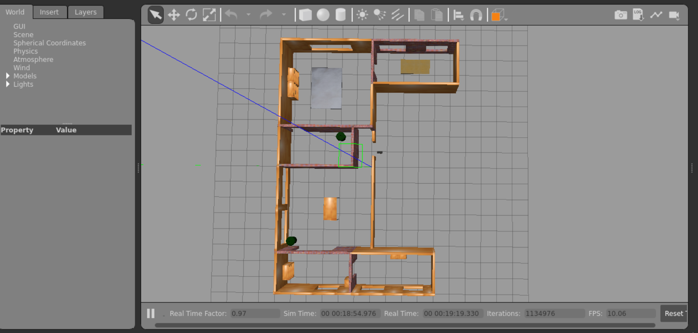
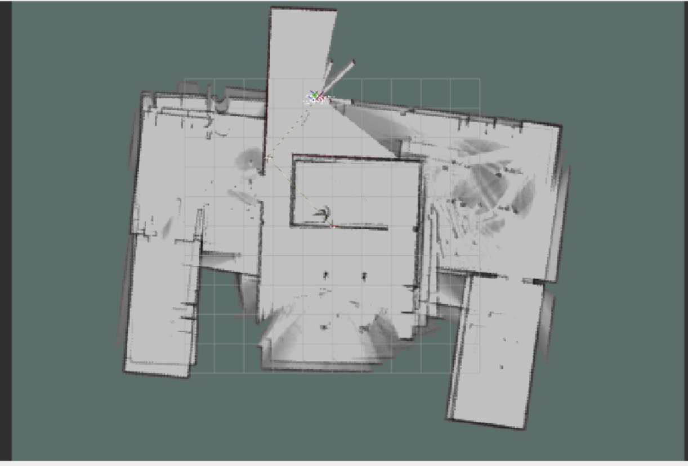
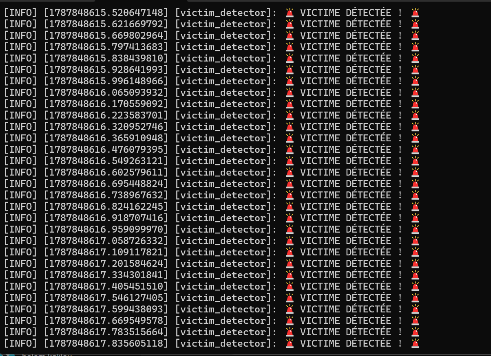
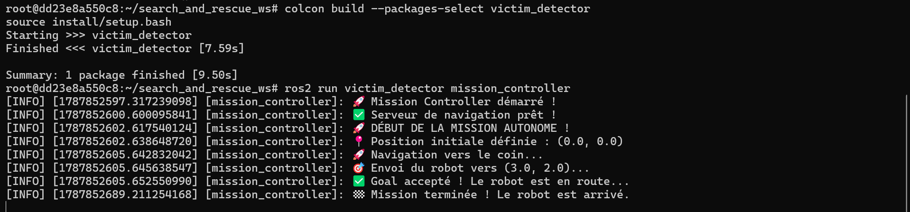

# 🤖 Autonomous Search & Rescue Rover

[](https://docs.ros.org/en/humble/)
[](http://gazebosim.org/)
[](https://www.python.org/)
[](LICENSE)

> **Contexte du projet** : Développement d'un système robotique autonome capable d'évoluer dans un environnement inconnu et complexe pour la recherche et le sauvetage (SAR). Ce projet démontre la maîtrise de la stack complète ROS 2 : de la simulation à la navigation autonome en passant par la vision par ordinateur.

## 🎯 Fonctionnalités Clés

- 🗺️ **Cartographie Temps Réel (SLAM)** : Génération de cartes 2D précises via l'algorithme *Cartographer*.
- 👁️ **Vision par Ordinateur** : Détection de cibles (victimes) par analyse de couleur avec *OpenCV*.
- 🧠 **Navigation Autonome** : Planification de trajectoire et évitement d'obstacles dynamiques via *Nav2*.
- 🐍 **Développement Sur Mesure** : Création de nœuds Python personnalisés pour l'orchestration des missions.
- 🐳 **Environnement Containerisé** : Déploiement reproductible sous Docker (Ubuntu 22.04 / ROS 2 Humble).

## 🏗️ Architecture du Système

```mermaid
graph TD
    A[Gazebo Simulation] --> B[LiDAR & Camera]
    B --> C[SLAM Toolbox]
    B --> D[OpenCV Detection]
    C --> E[Carte 2D]
    D --> F[Position Victime]
    E --> G[Nav2 Stack]
    F --> G
    G --> H[Commandes Robot]


---

### 📝 ÉTAPE 2 : Colle la deuxième moitié (la suite)

1. Clique avec ta souris **tout en bas** du texte que tu viens de coller (juste après le dernier ```).
2. Appuie sur la touche **Entrée** de ton clavier pour sauter une ligne.
3. Copie **uniquement ce deuxième bloc** ci-dessous et colle-le à la suite :

```markdown
## 🚀 Phases du Projet

### Phase 1 : Environnement et Simulation
Configuration d'un environnement Docker robuste exécutant ROS 2 Humble. Intégration du robot **TurtleBot3 Waffle Pi** dans un monde complexe sous Gazebo pour tester les capteurs (LiDAR 360°, Caméra RGB).


*Environnement de simulation complexe avec le robot TurtleBot3.*

---

### Phase 2 : Cartographie SLAM
Implémentation de l'algorithme **SLAM Toolbox** pour permettre au robot d'explorer son environnement et de construire une carte 2D en temps réel.
- **Défi** : Synchronisation des données LiDAR et odonométrie.
- **Résultat** : Une carte `.pgm` / `.yaml` haute résolution de la maison, prête pour la navigation.


*Carte générée par le robot lors de l'exploration autonome.*

---

### Phase 3 : Détection de Victimes (Vision)
Développement d'un nœud Python personnalisé (`victim_detector`) utilisant **OpenCV** et `cv_bridge`.
- **Algorithme** : Conversion de l'image en espace colorimétrique HSV pour isoler les couleurs spécifiques.
- **Sortie** : Publication d'alertes en temps réel sur le terminal lors de la détection.


*Le nœud Python détecte les zones cibles via le flux caméra.*

---

### Phase 4 : Navigation Autonome et Mission Scriptée
Déploiement de la pile de navigation **Nav2**. Création d'un script de contrôle de mission (`mission_controller.py`) qui automatise le processus complet :
1. **Initialisation** : Envoi de la pose initiale au système de localisation (AMCL).
2. **Planification** : Envoi d'un objectif (Goal) via l'API Action de Nav2.
3. **Exécution** : Le robot calcule le chemin optimal, évite les obstacles et atteint la cible.


*Log du script Python montrant le succès de la mission autonome de A à Z.*

## 🛠️ Installation et Lancement

### Prérequis
- Docker Desktop installé.
- Un serveur X (VcXsrv) pour l'affichage graphique sous Windows.

### Lancer le projet

```bash
# 1. Démarrer le container ROS 2
docker start ros2_gazebo
docker exec -it ros2_gazebo bash

# 2. Configurer l'environnement
source /opt/ros/humble/setup.bash
export DISPLAY=host.docker.internal:0
export TURTLEBOT3_MODEL=waffle_pi

# 3. Lancer la simulation
ros2 launch turtlebot3_gazebo turtlebot3_house.launch.py


search_and_rescue_ws/
├── src/
│   ├── victim_detector/       # Package personnalisé (Python)
│   │   ├── victim_detector/
│   │   │   ├── victim_detector_node.py  # Algo Vision
│   │   │   └── mission_controller.py    # Algo Navigation
│   │   └── setup.py
└── map/                       # Cartes sauvegardées
    ├── map.pgm
    └── map.yaml


---

### ✅ ÉTAPE 3 : Sauvegarder
Descends tout en bas de la page GitHub et clique sur le bouton vert **"Commit changes"**.

En faisant ça en deux fois, ton texte ne sera plus coupé et tout le formatage (les titres, les images, le code) s'affichera parfaitement ! Dis-moi si ça a marché ! 🚀
